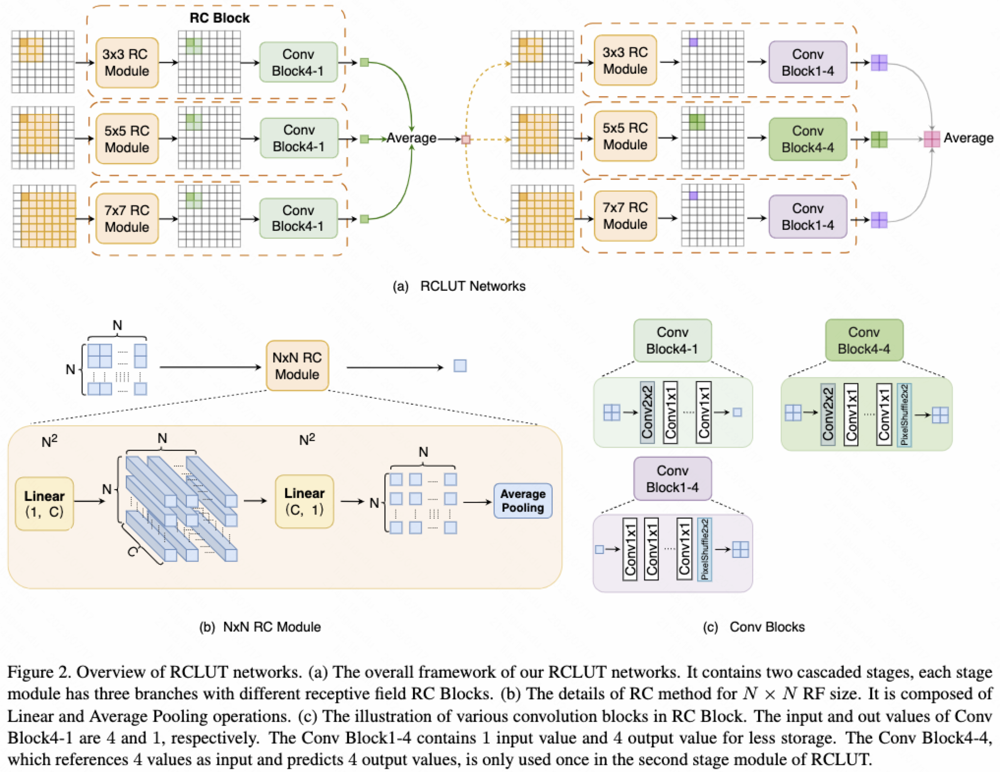

# Advice: don't work on this project

The [original RC-LUT repo](https://github.com/liuguandu/RC-LUT) had some [issues](https://github.com/liuguandu/RC-LUT/issues) that are not resolved yet. The author didn't answer to any of the questions. 

AFAIK the network architecture defined in the code is very different from what they said in the paper. Besides, even if I run their code I couldn't reproduce the results in their paper. I encountered [this](https://github.com/liuguandu/RC-LUT/issues/2#issuecomment-1949619761) problem which haven't been solved yet. The are [claims](https://github.com/liuguandu/RC-LUT/issues/2#issuecomment-1920403890) that the correct code would be released soon, but the repo has been inactive for 8 months. The last commit was on Jul 17, 2023.

I suspect if they actually wrote the code and got the results in their [paper](https://openaccess.thecvf.com/content/ICCV2023/papers/Liu_Reconstructed_Convolution_Module_Based_Look-Up_Tables_for_Efficient_Image_Super-Resolution_ICCV_2023_paper.pdf), or they just made up the numbers. 

If, however, you decided to continue, the following is the original README:


## Reconstructed Convolution Module Based Look-Up Tables for Efficient Image Super-Resolution

[Guandu Liu*], Yukang Ding, Mading Li, Ming Sun, Xing Wen and [Bin Wang#]

## Efficiency

## Overview
The core idea of our paper is RC Module.


## Usage
Our code follows the architecture of [MuLUT](https://github.com/ddlee-cn/MuLUT). In the sr directory, we provide the code of training RC-LUT networks, transferring RC-LUT network into LUts, finetuning LUTs, and testing LUTs, taking the task of single image super-resolution as an example.
In the `common/network.py`, `RC_Module` is the core module of our paper.
### Dataset

Please following the instructions of [training](./data/DIV2K/README.md). And you can also prepare [SRBenchmark](./data/DIV2K/README.md)
### Installation
Clone this repo
```
git clone https://github.com/liuguandu/RC-LUT
```
Install requirements: torch>=1.5.0, opencv-python, scipy
### Train
First, please train RC network follow next code
```
sh ./sr/5x57x79x9MLP_combined.sh
```

updating...
